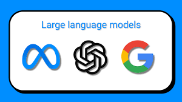

# Large Language Model Repository

  This repository serves as a centralized hub for my contributions to large language models (LLMs). Here, you'll find my work on developing and fine-tuning LLMs, along with associated resources and documentation. By maintaining all my LLM contributions in this repository, I aim to provide a comprehensive overview of my work in this domain.

## QA Chatbot - Cloud Vector Store
This is a QA chatbot created using Langchain and Cloud Vector Store, and built with the Streamlit interface.
- **Overview**
      This chatbot is designed to answer user questions based on a pre-trained knowledge base. It uses Langchain for natural language processing and Cloud Vector Store for storing and retrieving the knowledge base.
- **Features**
  - User-friendly interface built with Streamlit
  - Natural language processing powered by Langchain
  - Knowledge base storage and retrieval using Cloud Vector Store
- **Installation**

    To run the chatbot locally, follow these steps:
    1. Clone the repository `https://github.com/hargurjeet/VectoreStore_Streamlit_Projects.git`
    2. Install the required dependencies using `pip install -r requirements.txt`
    3. Run the application using `streamlit run app.py`
- **Usage**
      Once the application is running, you can interact with the chatbot by asking questions in the provided input field. The chatbot will process the question and provide an answer based on the knowledge base.

- **Contributing**

    If you would like to contribute to this project, please fork the repository and submit a pull request with your changes.

    
